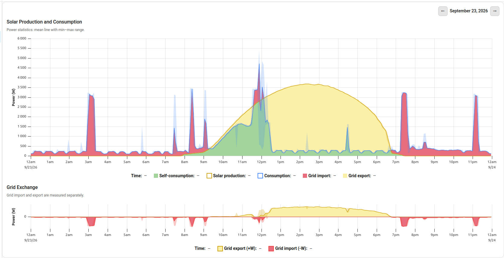
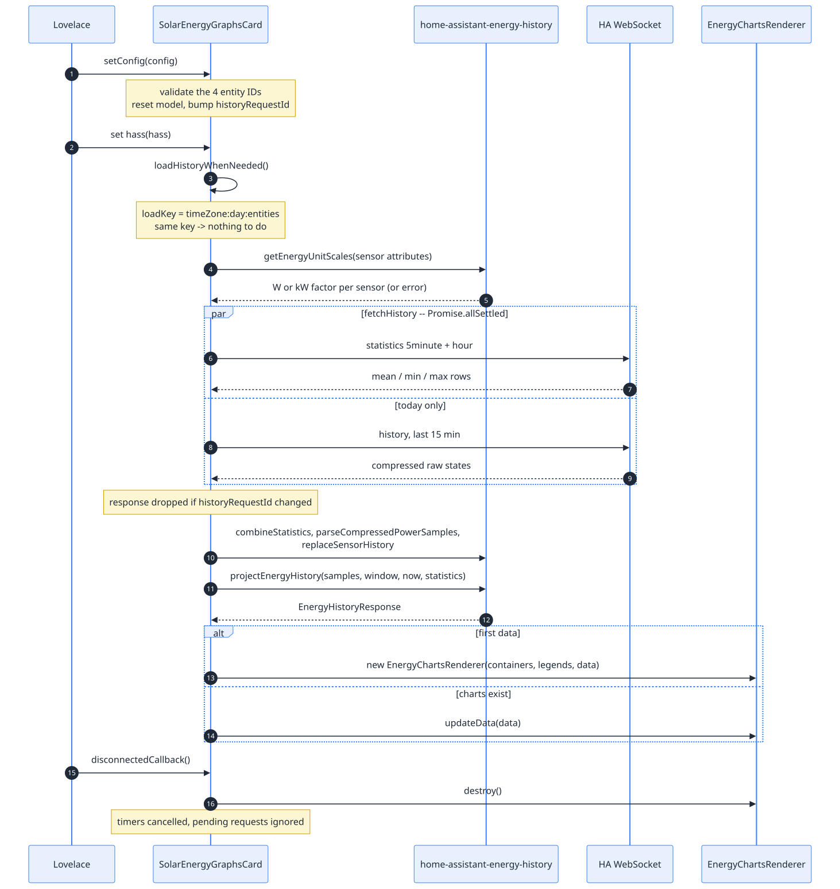
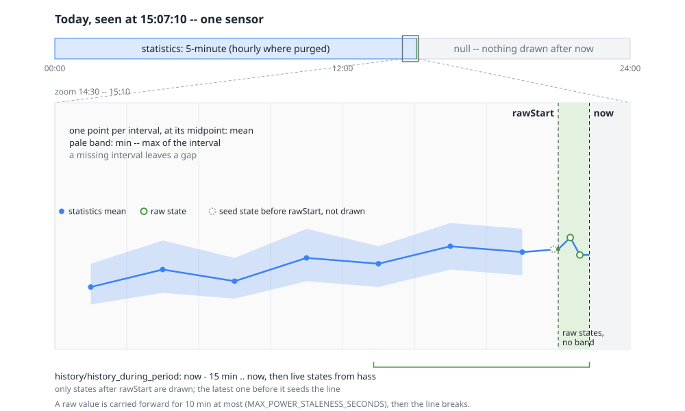
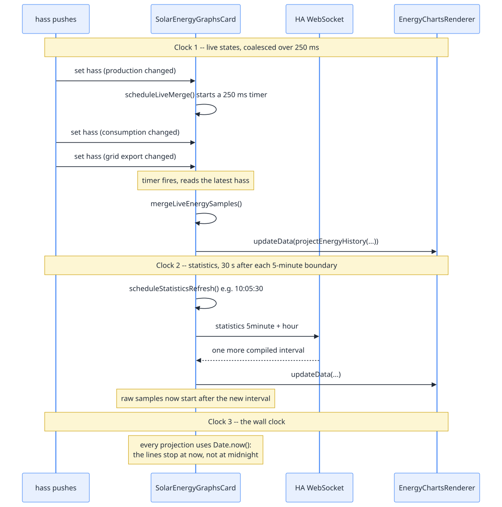
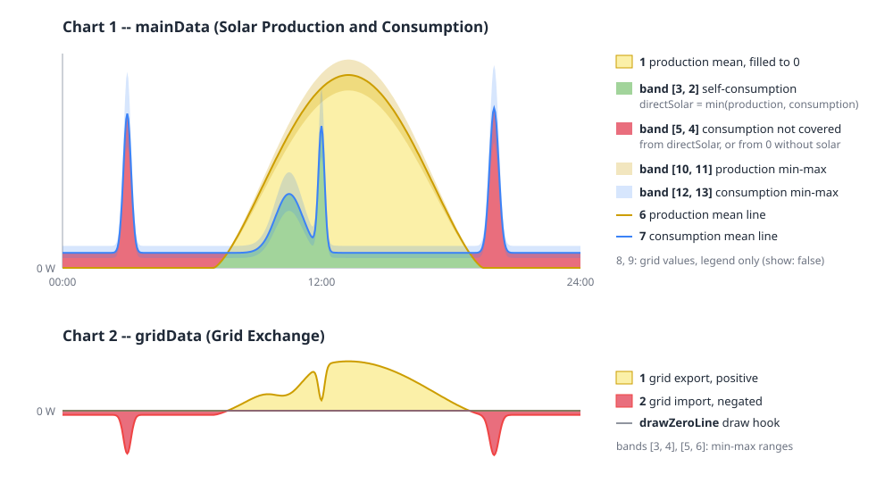

# Solar Energy Graphs Card -- Architecture guide

Welcome aboard. This guide explains how the card works, from the Home Assistant
data to the pixels, and how to work on it. Read it top to bottom once (about
15 minutes); after that, the diagrams are the quick reference.

- [In 30 seconds](#in-30-seconds)
- [The big picture](#the-big-picture)
- [File map](#file-map)
- [Lifecycle of the card](#lifecycle-of-the-card)
- [The data pipeline](#the-data-pipeline)
- [One day on the time axis](#one-day-on-the-time-axis)
- [Today: three clocks](#today-three-clocks)
- [Day navigation](#day-navigation)
- [Anatomy of the charts](#anatomy-of-the-charts)
- [Robustness rules](#robustness-rules)
- [Development environment](#development-environment)
- [Where do I change...?](#where-do-i-change)
- [Further reading](#further-reading)

## In 30 seconds

The card is a Lovelace custom element, `custom:solar-energy-graphs-card`,
shipped as a single ES module. It reads four power sensors (production,
consumption, grid import, grid export) and draws one day of them in two uPlot
charts that share their cursor and horizontal zoom.

Past data comes from Home Assistant **statistics** (mean, min, max per
5 minutes); the current day is extended with **raw states** and **live
updates**. Everything between "Home Assistant answered" and "uPlot draws" is
pure, unit-tested TypeScript.

Dark theme

## The big picture

Three layers, three responsibilities:

| Layer | Knows about | Does not know about |
| --- | --- | --- |
| `SolarEnergyGraphsCard` | Lit, `hass`, timers, the DOM | how series are computed |
| `home-assistant-energy-history.ts` | HA payload shapes, units, time zones | Lit, uPlot, the DOM |
| `EnergyChartsRenderer` | uPlot options, colors, theme, resize | Home Assistant |

The contract between them is one type, `EnergyHistoryResponse`: the column
arrays uPlot expects for each chart, plus four `has*` flags used for the status
messages.

## File map

All sources live in `src/`. Each module has a test file next to it.

| File | Role | Side effects | Tests |
| --- | --- | --- | --- |
| `index.ts` | Bundle entry point: registers the element | yes (import) | -- |
| `solar-energy-graphs-card.ts` | Lit element: config, lifecycle, WebSocket calls, timers, day navigation, status texts | yes | `solar-energy-graphs-card.test.ts` |
| `home-assistant-energy-history.ts` | Request builders, parsing, unit scaling, local-day windows, merging, projection to uPlot columns | **none** | `home-assistant-energy-history.test.ts` |
| `energy-charts-renderer.ts` | Creates, syncs, updates, themes, resizes and destroys the two uPlot charts | yes (DOM) | `energy-charts-renderer.test.ts` |
| `uplot-adapter.ts` | Single import point for uPlot and its CSS (inlined in the shadow DOM) | no | via the renderer tests |

The golden rule: **put logic in `home-assistant-energy-history.ts`**. It is
the only module you can test with plain inputs and outputs, and it is where
most bugs would hide (time zones, units, missing data).

## Lifecycle of the card

What the diagram shows, in words:

1. **`setConfig`** validates the four entity IDs and resets everything.
2. **`set hass`** is called by Home Assistant on *every* state change of *any*
   entity. It must stay cheap: it only picks the day, refreshes the theme,
   calls `loadHistoryWhenNeeded` and schedules a live merge.
3. **`loadHistoryWhenNeeded`** builds a load key `timeZone:day:entities`. Same
   key, nothing to do. A new key starts a load: unit scales are read from the
   sensor attributes (`getEnergyUnitScales` -- a wrong unit or class stops here
   with a message), then `fetchHistory` runs.
4. **`fetchHistory`** sends the statistics requests and, for today, the raw
   history request, in parallel with `Promise.allSettled`: one failure does not
   hide the other result.
5. The result is stored in a private `historyModel` (statistics + raw samples
   + day window + unit scales), then **`showCurrentModel`** projects it to
   `EnergyHistoryResponse`. The first projection creates the
   `EnergyChartsRenderer`; later ones call `updateData`.
6. **`disconnectedCallback`** destroys the charts and cancels the timers. When
   the card is reattached (dashboard edit mode, tab switch),
   `connectedCallback` rebuilds them.

## The data pipeline

The two branches meet in `projectEnergyHistory`, the heart of the card.

**Statistics branch.** `recorder/statistics_during_period` is asked for
`mean`, `min`, `max` with `units: { power: "W" }`, so Home Assistant converts
the unit itself. The card asks for both `5minute` and `hour` periods:
the recorder purges 5-minute statistics after `purge_keep_days` (10 by
default) but keeps hourly ones. `combineStatistics` keeps the 5-minute rows and
uses hourly rows only *before* the first 5-minute one.

**Raw branch.** Only for today. Raw states are not converted by Home Assistant,
so each value is multiplied by the factor from `getEnergyUnitScales` (`W` = 1,
`kW` = 1000). `replaceSensorHistory` installs the recorded states while keeping
live states that arrived during the request; `mergeLiveEnergySamples` appends
live states and returns the *same* object when nothing changed, which lets the
card skip a redraw.

**Projection.** `projectEnergyHistory` builds one shared time axis (`x`) for
all series -- the day start, every statistics midpoint, every raw timestamp,
`now` and the day end -- and aligns each sensor on it (`alignPowerSamples`).
It then derives the chart series: self-consumption, negated import, min-max
bounds (see [Anatomy of the charts](#anatomy-of-the-charts)).

> **Units in one sentence:** every number after parsing is in **W**, and every
> timestamp is in **seconds** since the epoch (Home Assistant statistics give
> milliseconds; the parser converts them).

## One day on the time axis

For one sensor, the line is made of three parts:

| Part | Source | Drawn as |
| --- | --- | --- |
| Midnight to `rawStart` | Statistics | mean at each interval midpoint, min-max band |
| `rawStart` to `now` | Raw states, then live states | line only, no band |
| `now` to midnight | -- | nothing (`null`) |

`rawStart` is the end of the sensor's last statistics interval, so it is
computed per sensor and moves forward every 5 minutes. A past day has no raw
part: it is statistics only.

## Today: three clocks

- **Live states, 250 ms.** Home Assistant pushes sensors one by one. The first
  push starts a 250 ms timer (`LIVE_UPDATE_COALESCE_MS`); when it fires, the
  card reads the *latest* `hass` once and merges all four sensors in a single
  redraw.
- **Statistics, every 5 minutes.** `scheduleStatisticsRefresh` waits for the
  next 5-minute boundary plus 30 s (`STATISTICS_REFRESH_DELAY_SECONDS`), the
  time Home Assistant needs to compile it, then reloads the statistics and
  re-arms itself.
- **Wall clock.** Every projection uses `Date.now()`, so the lines always stop
  at the present moment.

## Day navigation

- The selected day is a local date string (`YYYY-MM-DD`) in the Home Assistant
  time zone (`hass.config.time_zone`), never the browser's.
- Day boundaries come from `getLocalDayWindowForDate`, which handles 23-hour
  and 25-hour days at DST changes.
- Changing the day changes the load key, which triggers a new load; a
  response for the previous day is ignored when it arrives (see
  [Robustness rules](#robustness-rules)).

## Anatomy of the charts

uPlot works with column arrays: `data[0]` is the time axis, `data[i]` is series
`i`, and a band fills between two series. The numbers in the diagram are these
indexes. Several series exist only to support a band or a legend value; they
use the CSS class `hide-helper-legend` (hidden legend entry) or
`legend-values-only` (value in the legend, no curve).

Full column list of <code>mainData</code> and <code>gridData</code>

`mainData` -- Solar Production and Consumption:

| # | Content | Role |
| --- | --- | --- |
| 0 | time, seconds | x axis |
| 1 | production mean | yellow area down to 0, hidden legend |
| 2 | zero where self-consumption is defined | lower bound of band [3, 2] |
| 3 | `directSolar = min(production, consumption)` | **Self-consumption**, green band [3, 2] |
| 4 | `directSolar`, or 0 without production | lower bound of band [5, 4] |
| 5 | consumption mean | upper bound of red band [5, 4] |
| 6 | production mean | **Solar production** line |
| 7 | consumption mean | **Consumption** line |
| 8 | grid import mean | **Grid import**, legend value only |
| 9 | grid export mean | **Grid export**, legend value only |
| 10, 11 | production max, min | band [10, 11] |
| 12, 13 | consumption max, min | band [12, 13] |

`gridData` -- Grid Exchange:

| # | Content | Role |
| --- | --- | --- |
| 0 | time, seconds | x axis |
| 1 | grid export mean | **Grid export (+W)**, yellow |
| 2 | minus grid import mean | **Grid import (-W)**, red |
| 3, 4 | export max, min | band [3, 4] |
| 5, 6 | minus import min, minus import max | band [5, 6] |

Worth knowing:

- **Self-consumption assumes no battery**: it is simply
  `min(production, consumption)`.
- **Import and export come from separate sensors**; the card never derives
  one from the other. Import is negated only for drawing.
- The zero line of the grid chart is drawn by a uPlot `draw` hook,
  `drawZeroLine`.
- Both charts join the same `uPlot.sync` group: the cursor and the x zoom
  (drag horizontally) follow each other. The y axis stays independent.
- Colors are hard-coded in `energy-charts-renderer.ts`; axes and grid follow
  the Home Assistant theme (`--primary-text-color`, `--divider-color`, or
  fixed values in dark mode), refreshed by `refreshTheme`.

## Robustness rules

These patterns appear across the element; keep them when you add code.

| Rule | How |
| --- | --- |
| Never draw a stale answer | Every load increments `historyRequestId`; an async result whose id is outdated, or that arrives after disconnection, is dropped. |
| One failure does not hide the rest | `Promise.allSettled`; the model keeps what succeeded and the error is shown. |
| Tell the user what is wrong | Each chart has a status line; messages starting with `Error` get `role="alert"`. |
| Do not redraw for nothing | Identical load key, unchanged live samples or unchanged theme return early. |
| Fit the container | A `ResizeObserver` resizes each chart; zero sizes are ignored. |
| Leave nothing behind | `disconnectedCallback` cancels both timers and destroys the charts. |

## Development environment

**Only Podman is needed on your machine.** Node.js and npm run inside a
throw-away container built from `Containerfile` (Node 24 on Alpine, plus
Chromium for the documentation diagrams). Everything goes through `dev.sh`:

| Command | What it does |
| --- | --- |
| `./dev.sh install` | `npm install`, copies the updated `package-lock.json` back to the host. Use it after changing dependencies. |
| `./dev.sh typecheck` | `tsc --noEmit` |
| `./dev.sh test` | Vitest with happy-dom (`src/**/*.test.ts`) |
| `./dev.sh build` (default) | Typecheck + Vite library build, copies `dist/solar-energy-graphs-card.js` to the host |
| `./dev.sh deploy` | `build`, then copies the bundle to `../docker/ha-config/www/` for the repository's `ha-dev` Home Assistant |
| `./dev.sh diagrams` | Renders `docs/diagrams/*.mmd` to SVG with mermaid-cli, copies the SVGs to the host |

How it works:

- The source tree is mounted at `/source` and **copied** into the container,
  so the build never writes into your tree except the explicit outputs listed
  above.
- `node_modules` and the npm cache live in two persistent Podman volumes:
  nothing is installed on the host, and nothing is downloaded again unless
  `package.json` or `package-lock.json` changed (a hash stored in
  `node_modules` triggers `npm ci`).

A typical loop:

1. Change code and its test in `src/`.
2. `./dev.sh test`
3. `./dev.sh deploy`
4. Hard-refresh the dashboard in Home Assistant (`Ctrl+F5`) and check both
   themes. Automated tests never replace this visual check.

**Diagrams.** The Mermaid diagrams are `docs/diagrams/*.mmd` (style in
`mermaid.json`, labels rendered as plain SVG text); edit the `.mmd`, run
`./dev.sh diagrams`, and commit both files. `day-timeline.svg` and
`chart-layers.svg` are hand-made SVG: edit them directly.

## Where do I change...?

| I want to... | Go to |
| --- | --- |
| Change a color or a line width | `createOptions` in `energy-charts-renderer.ts` |
| Add or change a derived series | `projectEnergyHistory`, then the matching `series` / `bands` in `createOptions` (keep the indexes aligned) |
| Change what data is requested | `buildStatisticsRequest` / `buildHistoryRequest`, and `fetchHistory` / `fetchStatistics` in the element |
| Accept another unit | `powerUnitScale` in `home-assistant-energy-history.ts` |
| Tune live or refresh timing | Constants at the top of `solar-energy-graphs-card.ts` |
| Change the layout, titles or status texts | `render`, `styles` and `updateHistoryStatus` in `solar-energy-graphs-card.ts` |
| Change the configuration keys | `SolarEnergyGraphsCardConfig` and `setConfig`, then the README |

Before you start, read the scope and workflow rules in
[`AGENTS.md`](../../AGENTS.md): the card shows two graphs and what is needed to
read them -- no KPIs, toolbars or extra panels -- and sensor semantics are
never assumed without confirmation.

## Further reading

- [README](../README.md) -- installation and configuration (French)
- [TODO](TODO.md) -- open work (French)
